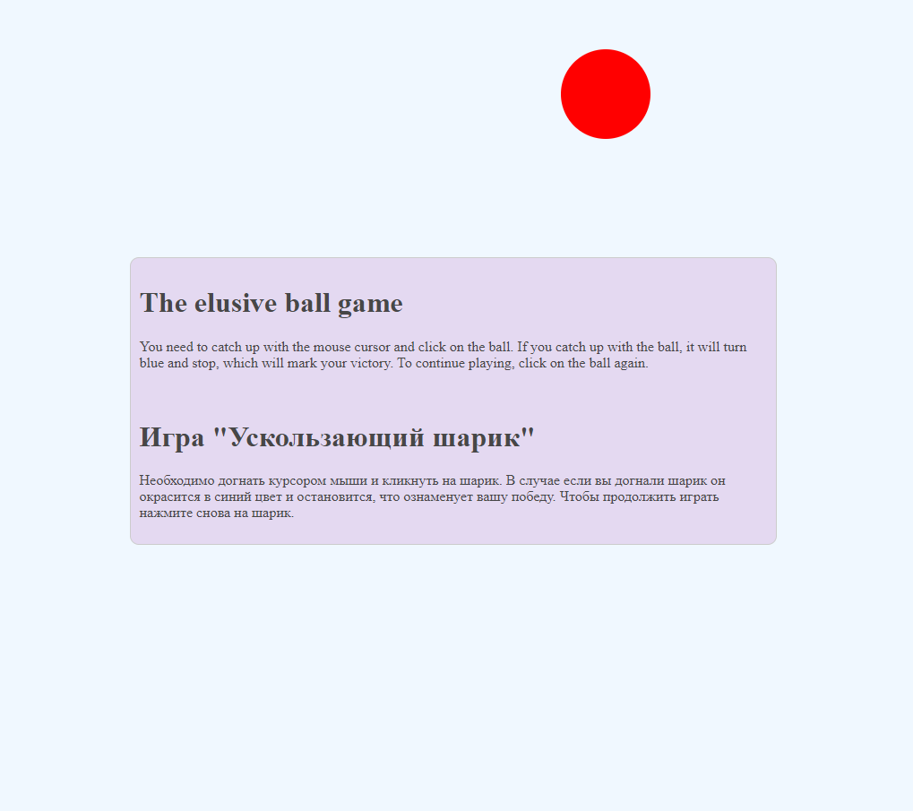
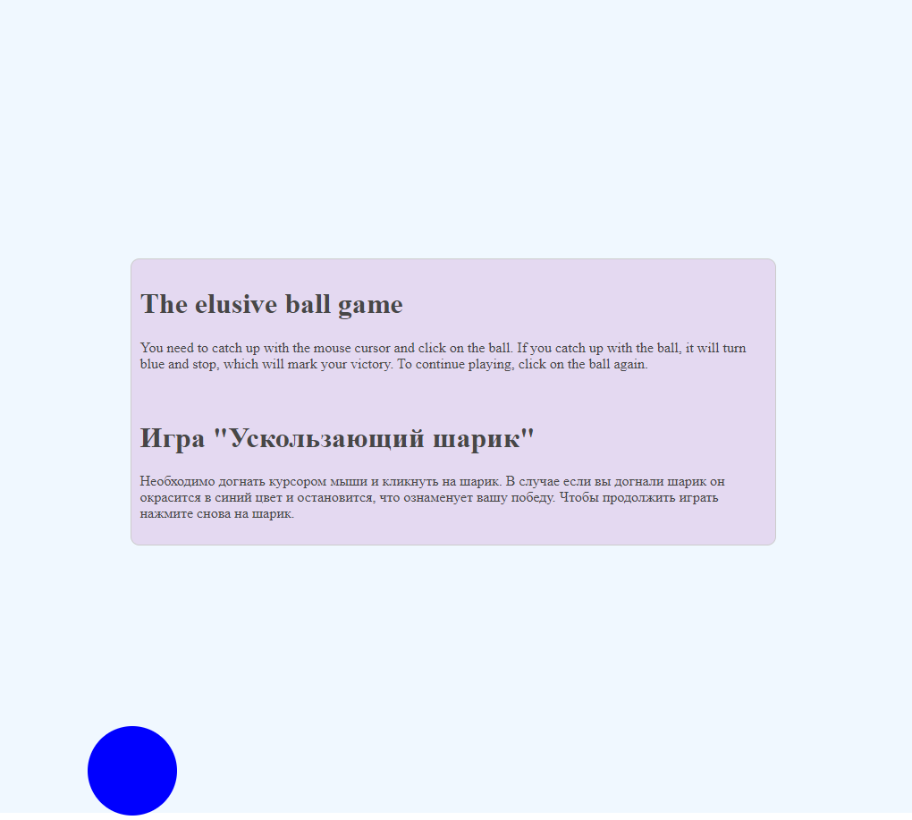

# The elusive ball game (Игра "Ускользающий шарик")

## Description(RU) (Описание)
Необходимо догнать курсором мыши и кликнуть на шарик. В случае если вы догнали шарик он окрасится в синий цвет и остановится, что ознаменует вашу победу. Чтобы продолжить играть нажмите снова на шарик.
Поиграть можно перейдя по ссылке https://ivan-ust402.github.io/MP-game-quess/.

## Description(En)
You need to catch up with the mouse cursor and click on the ball. If you catch up with the ball, it will turn blue and stop, which will mark your victory. To continue playing, click on the ball again.

You can play by following the link https://ivan-ust402.github.io/MP-game-quess/.

## Technologies used
* JavaScript
* CSS
* HTML

## Visual display of the application's operation

**Picture 1.** Game start screen.

**Picture 2.** Game end screen.
